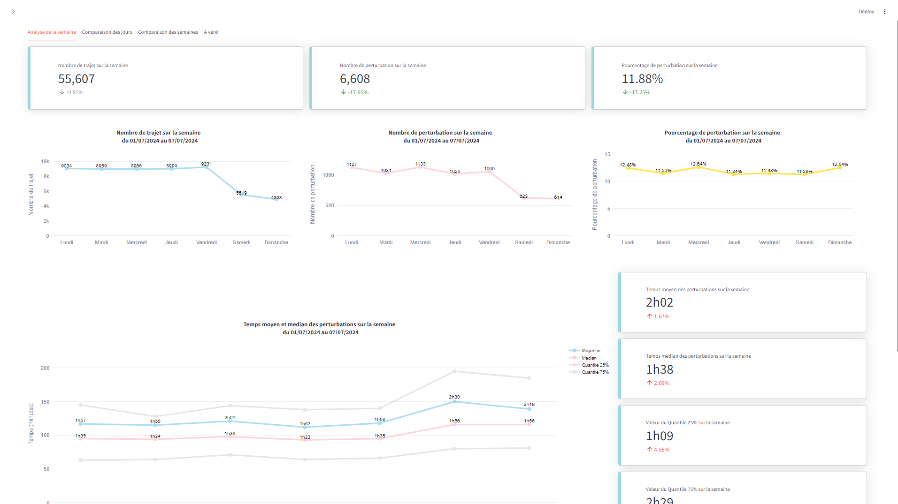

# DESCRIPTION DU PROJET

## Vidéo de démonstration

## Collecte des données

La collecte des données repose principalement sur deux sources :

- L'API de la SNCF pour les données relatives aux TER et TGV : https://api.sncf.com/v1
- Des bases de données open source de la SNCF et de l'INSEE.

Ces sources offrent un accès à de nombreuses données sur les réseaux de transports publics en France (perturbations, trajets, lignes, etc.). Un script automatisé interroge régulièrement cette API pour récupérer les données nécessaires à l'analyse.

## Fonctionnalités

### Fonctionnalités présentes 
-
-
-

### Fonctionnalités à venir 
- Extension du projet aux réseaux IDF avec l'utilisation de l'API de Navitia : https://api.navitia.io/v1
